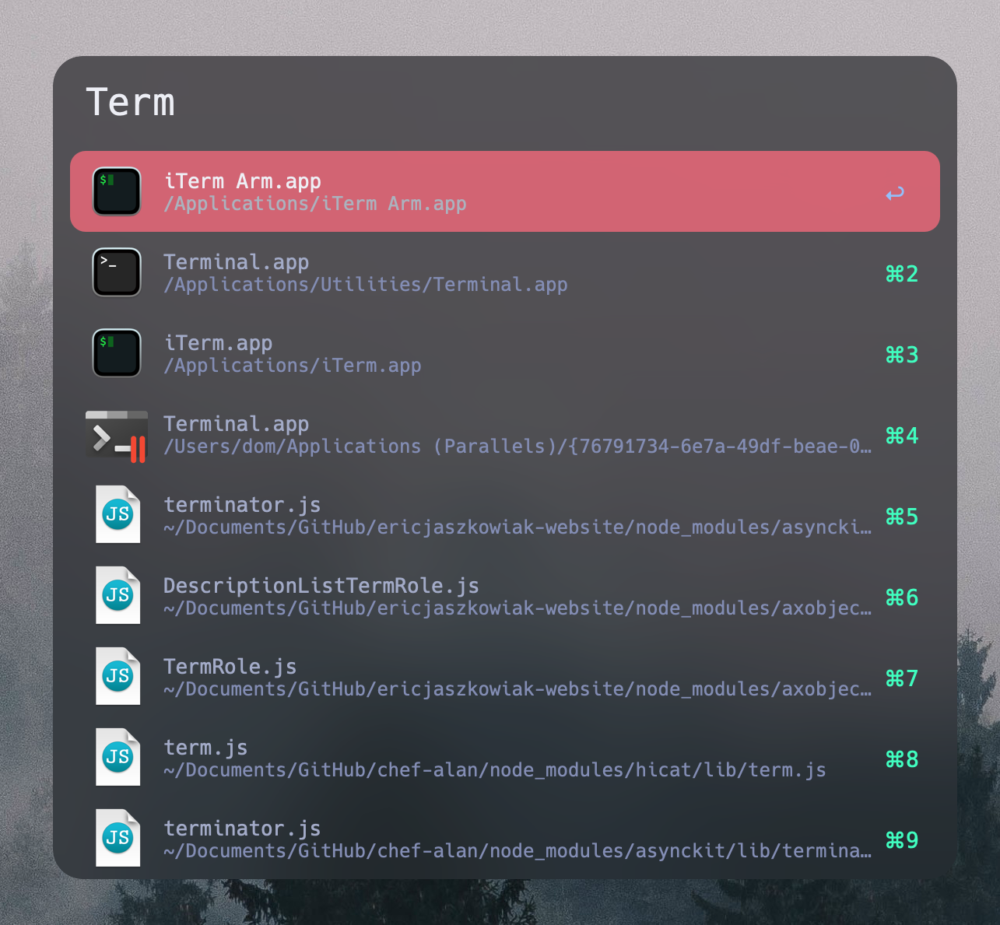

# Dom's .dotfiles
A OneDark inspired MacOS theme (rice)


# Installation

To install my dotfiles all you need is the command line. Chezmoi will do everything for you!

---

## Chezmoi
I am using [Chezmoi](https://www.chezmoi.io/) to manage my dotfiles because it is free and cross platform. To get started install chezmoi using

```bash
$ sh -c "$(curl -fsLS chezmoi.io/get)" -- init --apply domogami
```
This command will establish symbolic links between your home directory and the chezmoi directory containing the dotfiles. Check to ensure that the dotfiles have been created successfully in your home directory.

# Software I Use

These are the tools that I have found most helpful when attempting to design the perfect version of MacOS. All of these tools have contributed in some way to my current MacOS setup.

## iTerm2

I am using [iTerm2](https://iterm2.com/) as my primary terminal because of its customizability, tabular ability, and native window tiling. I began using iTerm2 over 2 years ago and I have grown to love it. I am using a custom color scheme that takes inspiration from OneDark but uses a transparency effect and blur radius to let the trees in my background come through.

## Alfred 4

[Alfred 4](https://www.alfredapp.com/) was one of the best purchases I made for my Mac. Alfred is a spotlight replacement that extends far beyond the capabilities of spotlight. Alfred allows for "workflows" which are sequences of commands that can be executed including launching applications, running code or scripts, opening a specific file/directory in a specific application, etc.



## Fig

[Fig](https://github.com/withfig/fig) is one of my most used terminal applications that I use every single day. Fig will autocomplete and suggest file paths as you type them in the terminal. Frequently used paths will be suggested and all of them can be easily inserted with `tab`. Fig also lists all available flags for a command which can be extremely helpful in some cases. 

## Übersicht

[Übersicht](https://tracesof.net/uebersicht/) is a powerful MacOS widget that allows MacOS to render widgets like my wallpaper clock and my bar at the top that displays my spaces and important information on the right.

## Window Management with Yabai + SKHD + Karabiner

[Yabai](https://github.com/koekeishiya/yabai) has completely changed the way I use MacOS and has boosted my productivity exponentially. Yabai allows navigation between spaces with keyboard shortcuts and automatically tiles windows using binary space partitions. It also allows for inactive windows to have a different opacity and allows the active window and non-active windows to have customizable borders.

[SKHD](https://github.com/koekeishiya/skhd) is a tool built for yabai that allows a user to set all of the keybindings that will be used for yabai to function. For example, I have `hyper + h` to focus the left window and `hyper + l` to focus the right window. I can also move to space 2 instantly using `hyper + 2`.

[Karabiner](https://karabiner-elements.pqrs.org/) is a tool that I use to map the caps lock key to hyper (cmd + ctrl + option) because I found that I never use the caps lock key for any reason. This has proven incredibly helpful and allows me to continue using Yabai on keyboards that are non-programmable.

## Simplebar

I love using [Simplebar](https://github.com/Jean-Tinland/simple-bar) because of its clean aesthetic and seamless integration with Yabai. To the left you can see a visual representation of your MacOS spaces and which space you are currently viewing. This helps me visually separate each space and easily remember which spaces can be accessed with each keybinding. After using simple-bar for a while I began using [simple-bar-lite](https://github.com/Jean-Tinland/simple-bar-lite) which is a minimal version of simple-bar which I enjoy for now.

## LunarVim

[LunarVim](https://github.com/LunarVim/LunarVim) has been my recent text editor of choice. As an extension of NeoVim it features many of the expected shortcuts macros that come with Vim with helpful additions like [Telescope](https://github.com/nvim-telescope/telescope.nvim), a language server, and keyboard shortcuts that are easier to learn with the help of popups.

## Spotify-tui
[Spotify-tui](https://github.com/Rigellute/spotify-tui) is my primary spotify client that I can use from the terminial with vim shortcuts. It is easy to enter and navigate and features intuitive keybindings.

## Htop / Neofetch / Pipes

[Htop](https://github.com/htop-dev/htop) is a terminal process viewer to easily view active tasks and visualize resource usage.

[NeoFetch](https://github.com/dylanaraps/neofetch) is a command line tool that displays system information and hardware with an ASCII art logo of your operating system icon. I love this little tool so much that I have it run every time I open a new terminal by adding it to my `.zshrc` file.

[Pipes](https://github.com/pipeseroni/pipes.sh) is a fun terminal screensaver and background eye candy that I love to have running when I have extra screen space. These animated pipes will brighten your day one pipe at a time.

[Tty-clock](https://github.com/xorg62/tty-clock) is a terminal clock that stands out for its block design and is nice to have when coding to remind yourself of how long it has been since you have gotten up.

## Zathura pdf Reader
After taking many mathematics courses in university I wrote quite a lot of LaTeX. Senior year, I switched to using vim with LaTeX snippets to save time which worked phenomenally. However, having to compile latex myself instead of using a tool like [Overleaf](https://www.overleaf.com/) meant that I needed to use a pdf reader. On my search for finding the perfect pdf reader I found [Zathura](https://github.com/pwmt/zathura) which allows for custom colors and features vim shortcuts to scroll through the pdf.  

## Oh-My-Zsh + p10k
I love Oh-My-Zsh because of its incredible aesthetic and customizability. Combined with p10k and a font that supports nerd icons the command line looks stunning.

## Fonts
Originally I was using Hack Nerd Font and grew to really enjoy it, however I realized that it does not support ligatures which is something that I really enjoy having. Luckily, the user pyrho has added ligatures to [Hack Nerd Font w/ Ligatures](https://github.com/pyrho/hack-font-ligature-nerd-font)! This has become my go-to font of choice.
